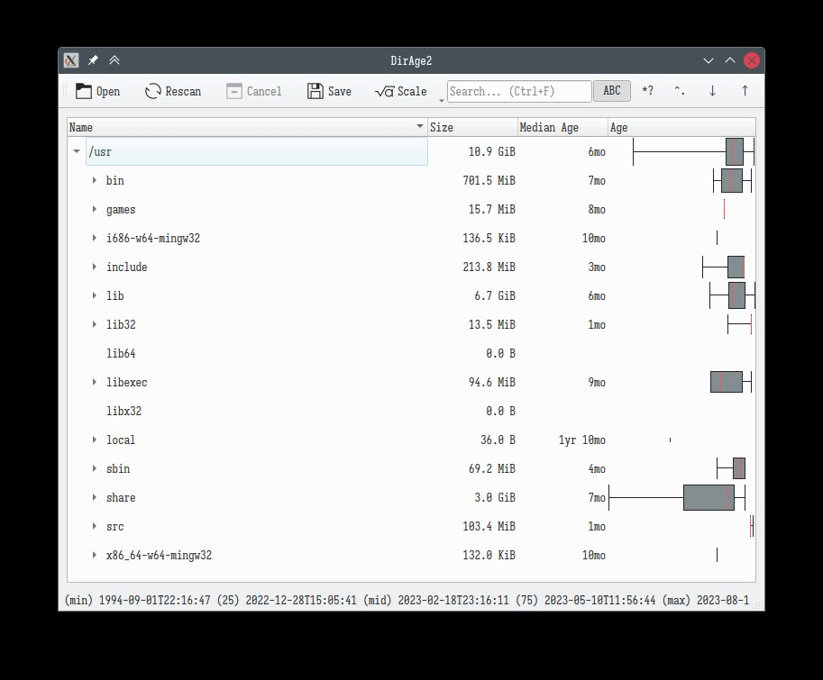

 # DirAge2
 
Show a box plot of the selected directory, based on file time.
This application was developed on and for Linux and requires Debian Bookworm 
or later or equivalent (glibc 2.36 for the AppImage).

From September 28th, 2023 github is requiring 2FA. This project will probably
be on gitlab by that time.

- The box plot whiskers are set at 5th and 95th percentiles.
- When saving the report to JSON, the values in the arrays represent
  percentiles 0, 5, 25, 50, 75, 95, 100.
